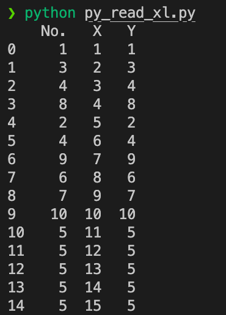
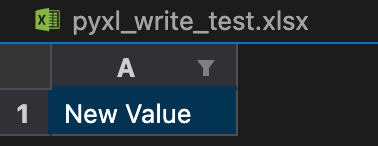
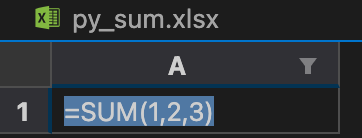
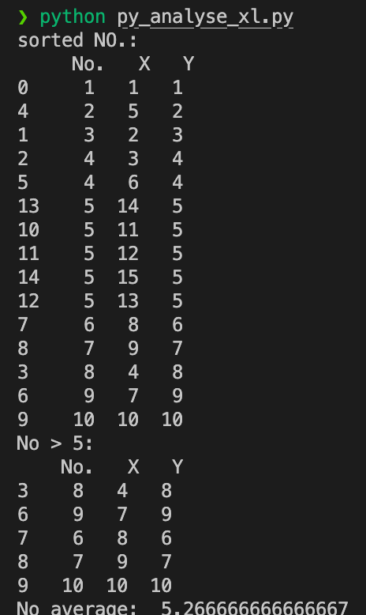
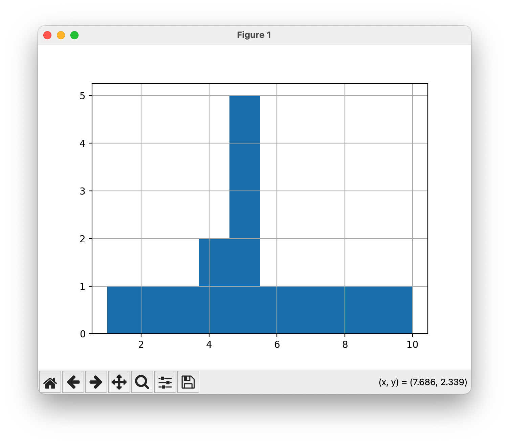
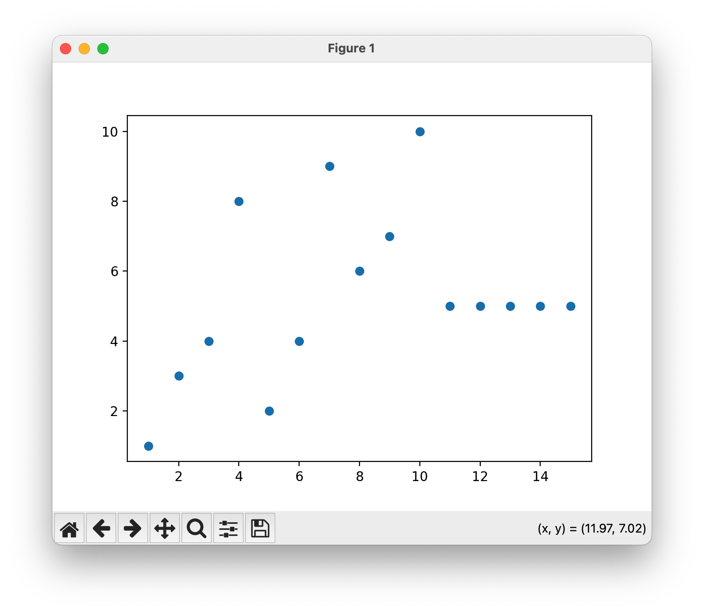
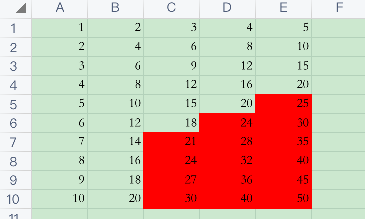

# python read and write excel

## create virtual environment
```shell
python -m venv pyExcel
```
## python package install
```shell
pip install --upgrade pip
pip install pandas
pip install matplotlib
pip install openpyxl
```

package list
```shell
❯ pip list
Package         Version
--------------- -----------
contourpy       1.2.1
cycler          0.12.1
et-xmlfile      1.1.0
fonttools       4.53.1
kiwisolver      1.4.5
matplotlib      3.9.1
numpy           2.0.0
openpyxl        3.1.5
packaging       24.1
pandas          2.2.2
pillow          10.4.0
pip             24.1.2
pyparsing       3.1.2
python-dateutil 2.9.0.post0
pytz            2024.1
six             1.16.0
tzdata          2024.1
```

## exam-001: read excel
```shell
python py_read_xl.py
```


## exam-002: write excel
```shell
python py_write_xl.py
```


## exam-003: write sum formula to excel
```shell
python py_sum_xl.py
```



## exam-004: analyse excel
```shell
python py_analyse_xl.py
```


## exam-005: plot excel
```shell
python py_plot_xl.py
```



## exam-006: condition format
```shell
python py_format_xl.py
```
